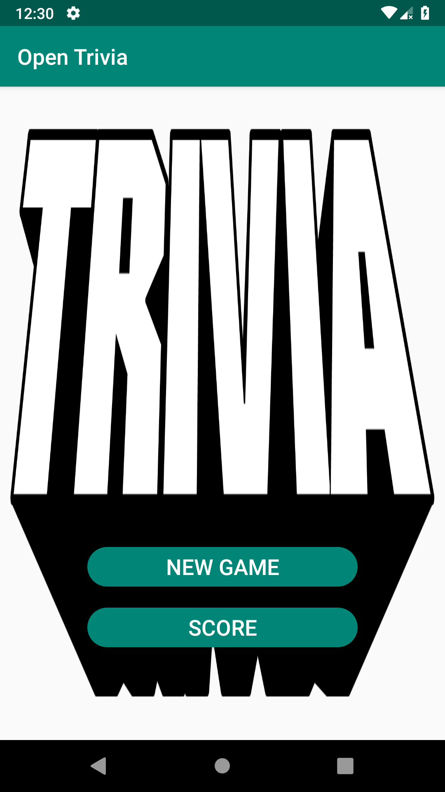
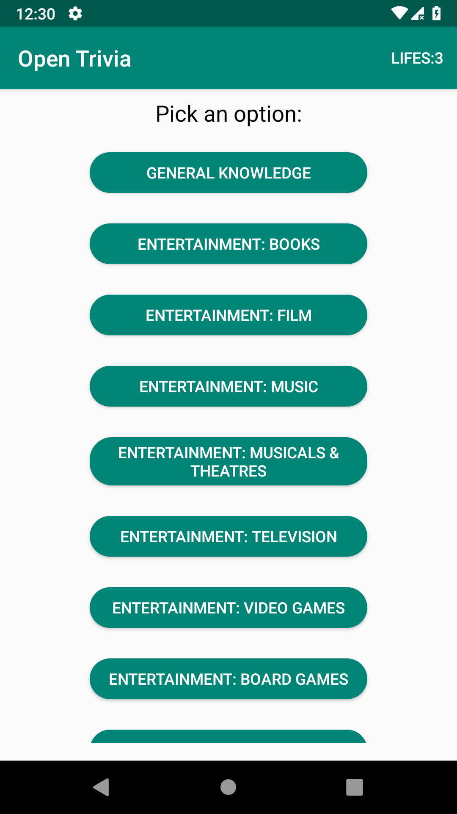
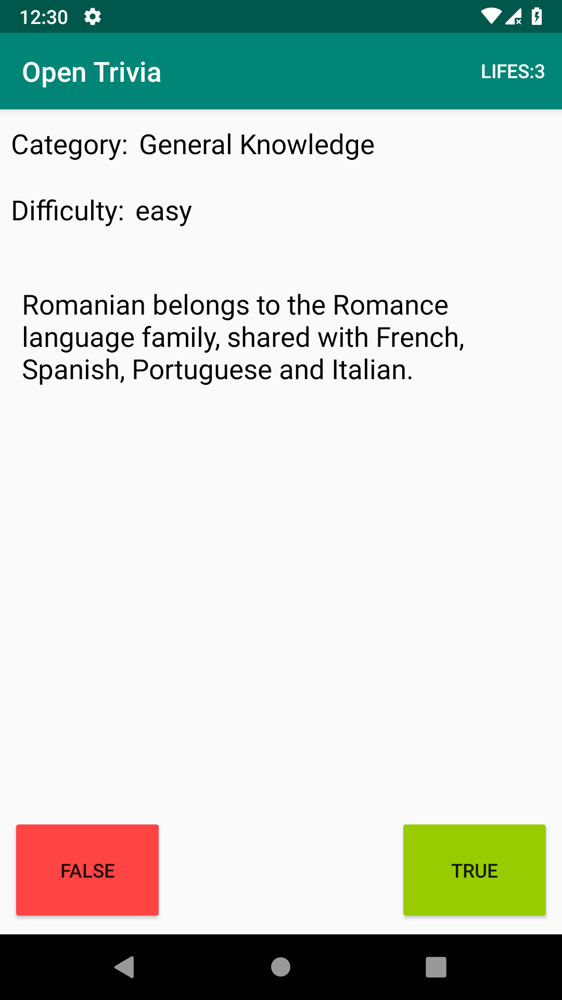
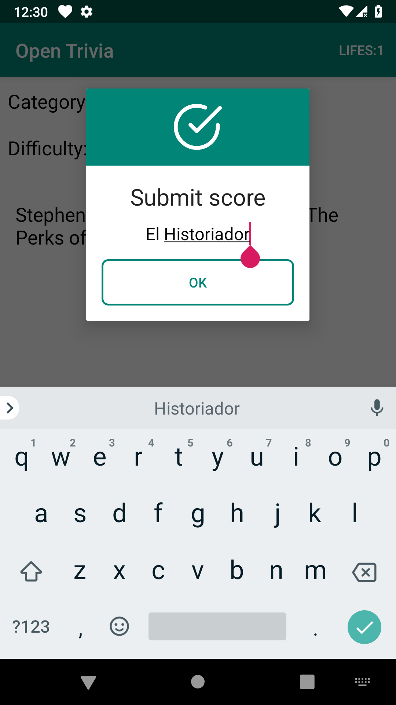
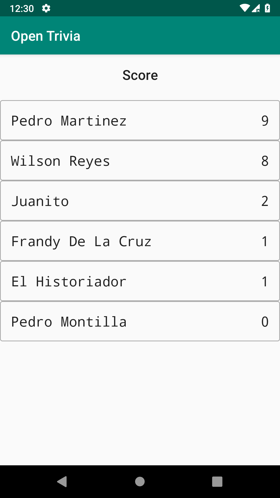
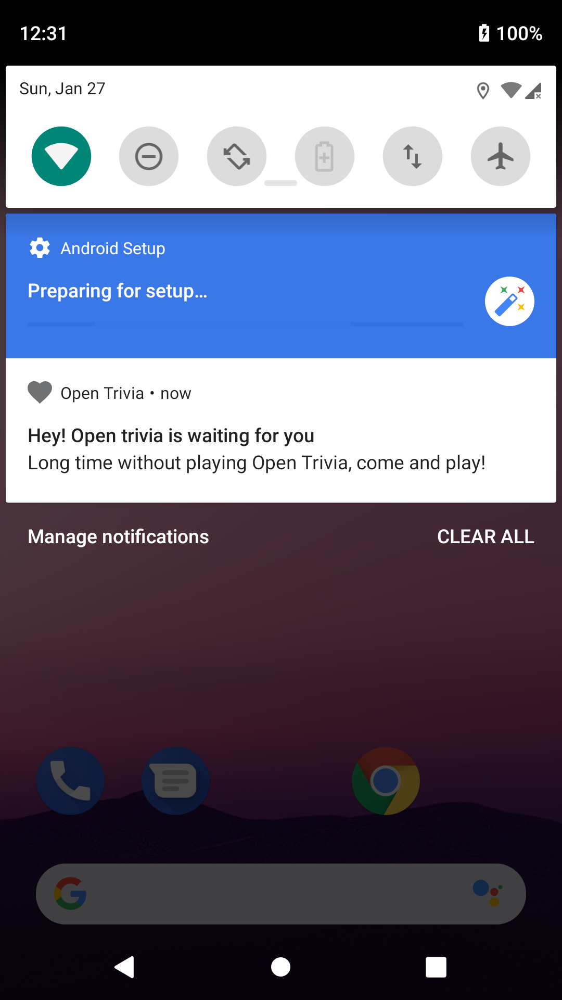

# open-trivia-android

Tivia game made as a homework of the Android Course at UNAPEC.

## Built With
* RecyclerView: showing the category of the questions and the user's score
* Retrofit: consuming the https://opentdb.com/ API
* Evernote Android-Job Library: showing a notification periodically
* Room Persistence Library: storing locally the user and its score, and further showing the data in the score activity
* SharedPreference Persistence: storing the user that plays

## Screenshots

